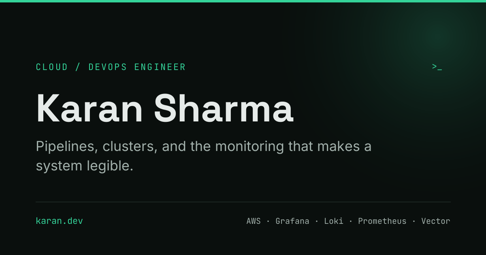

# karan7sharma.github.io

My portfolio. **[karan7sharma.github.io](https://karan7sharma.github.io)**

Single page, built with Astro 5 and Tailwind v4. No React, no framework runtime —
about 3 KB of JavaScript on first paint, and the one interactive thing on the page
is hand-written canvas.



---

## Running it

```bash
npm install
```

```bash
npm run dev
```

Then open http://localhost:4321

## Stack

| | |
|---|---|
| Framework | Astro 5, static output |
| Styling | Tailwind v4 via PostCSS, all design tokens in one `:root` block |
| Type | Space Grotesk, Inter, JetBrains Mono — self-hosted, latin subsets only |
| Hosting | GitHub Pages, deployed by Actions on every push to `main` |

## Structure

```
src/
├── data/        all content — editing the site means editing these files
├── components/  one per section of the page
├── game/        physics · render · sound · mount  (no DOM in physics.ts)
├── layouts/     BaseLayout.astro — head, meta, OG, JSON-LD, no-flash theme
├── pages/       index.astro · 404.astro
└── styles/      global.css — every design token lives here
```

Content is separated from markup: `site.ts`, `skills.ts`, `projects.ts` and
`timeline.ts` drive everything. Updating the site never means opening a component.

---

## A few things I'm pleased with

**The ball is real geometry.** `src/game/render.ts` holds the twelve pentagon
centres of a truncated icosahedron — the actual construction of a Telstar
football — rotates them in 3D each frame, culls the back hemisphere and projects
what survives. Two rotation axes, because a ball spinning flat looks wrong: one
rolls with horizontal speed, the other tumbles with vertical.

**Strikes obey contact geometry.** The impulse runs from the contact point through
the centre, so hitting the right-hand side sends the ball left. Lift, sideways
speed and spin all scale with how far off-centre you connect — a rim strike trades
about a third of its lift for width.

**Fixed 120 Hz timestep** with an accumulator and a clamped frame delta, verified
identical at 30 / 60 / 120 / 144 / 240 Hz so the game plays the same on any
display. `physics.ts` has no DOM references at all, which is what makes that
testable in isolation.

**Sound is synthesised, not sampled.** No audio files to ship or license. A boot
contact is three stacked layers — a bandpassed noise transient for the leather
slap, a pitched body that drops as the panel flexes, and a low sine for mass —
with per-hit detuning so a long rally never sounds cloned.

**The game costs nothing until you reach it.** Dynamic import behind an
IntersectionObserver, and the loop pauses when the section leaves the viewport or
the tab is hidden.

**Accessibility isn't bolted on.** All 34 ink-on-surface combinations clear WCAG AA
in both themes, tightest 4.67:1. Every animation respects
`prefers-reduced-motion`, the game is keyboard playable, and the theme is applied
before first paint so there's no flash.

Maintenance notes, rollback steps and the OG image generator are in
[docs/NOTES.md](docs/NOTES.md).

## Licence

Code is free to learn from. The written content, CV and photography are mine —
please don't redeploy this as your own portfolio.
